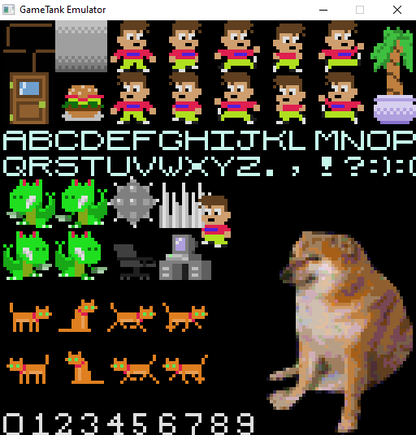
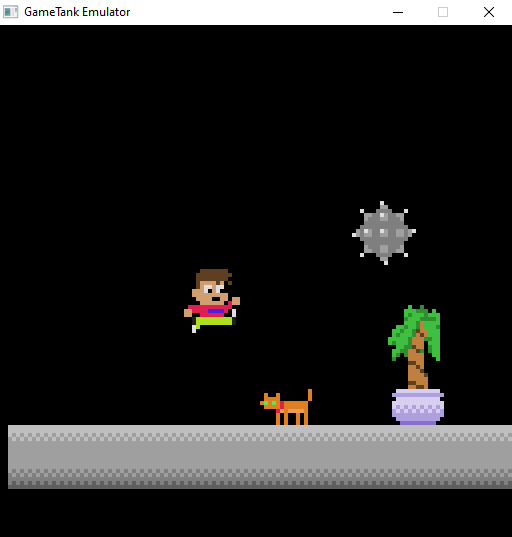

# GameTank Emulator

An emulator project for the GameTank 8-bit game console, to speed cross-development of software for the real system.

Powered by gianlucag's 6502 emulator library. (Forked to add some WDC 65C02 opcodes)

I mainly develop this on Windows 10 but have also built it on Ubuntu. The Makefile checks for Windows or Linux. (OSX eventually?)
For setting up the build enviroment I uzed LazyFoo's directions: http://lazyfoo.net/tutorials/SDL/01_hello_SDL/index.php

|  |  |
|-----------------|--------------------|

## How to use:
The emulator is meant to test the same ROM files that I'd normally flash to an EEPROM cartridge. You can start the emulator with a ROM file
either from the command line eg. `./GameTankEmulator.exe conway.gtr` or by dragging the ROM to the executable in Windows Explorer.

ROM files can be produced using the [VASM assembler](http://sun.hasenbraten.de/vasm/) for WDC65C02 code, and should be output as headerless binaries.

ROM files should ideally be either 8192 bytes, 32768 bytes, or 2097152 bytes.

| **Type** | **Length**     | **Mapping**                                                                   |
|----------|----------------|-------------------------------------------------------------------------------|
| 8K       | 8192           | 0xE000-0xFFFF                                                                 |
| 32K      | 32768          | 0x8000-0xFFFF                                                                 |
| 2M       | 2097152        | 0x8000-0xBFFF (movable)  0xC000-0xFFFF (fixed)                            |
| UNKNOWN  | Anything else  | End of file aligned with 0xFFFF  Access up to 32K at the end of the file. |

Gamepad input is emulated (only on port A right now) with the arrow keys, Z, X, C, and Enter.

Other utility keys are:

* Hold F to go Fast (skip SDL_Delay between batches of emulated instructions)

* Press R for soft Reset (set registers to zero, jump execution to the RESET vector, but otherwise memory is left intact)

* Shift+R for HARD reset that randomizes memory and registers, to simulate a cold boot

* Press Esc to exit the program

* Press O to load a rom file at runtime. The dialog also appears if the emulator is launched without specifying a rom file.

* Press F9 to load the profiling window. (Only does anything if the ROM uses the debug hooks)

* Press F10 to open a window that displays some system state info such as the CPU status register or the contents of video/graphics memory.

For Windows users, I've set up an automated [nightly build](https://clydeshaffer.com/builds/GameTankEmulator/latest.php) that contains the latest features... and of course the latest bugs.

_For now I'm listing the differences between the emulator and the real hardware; stopping short of writing a programming manual for the GameTank which will be a separate wiki-like document to come later_

## Emulated Capabilities:

### Video:

The graphics board of the GameTank has all its features emulated in a _mostly accurate_ fashion. The emulated graphics can do anything you probably intended to do on the real thing, minus the composite video artifacts.

On the graphics board is 32K of framebuffer memory, 32K of "asset" or "sprite" memory, and a handful of control registers for a blitting engine. The rendered image is 128x128 pixels, though a TV cuts off the first and last few rows for an effective resolution of 128x100. Also the column 0 color is used for the border on each row, stretching between the image area and the true edges of the screen.

The DMA controller can be configured for direct CPU access to either page of the framebuffer, either page of the asset memory, or access to the blitting registers. Blitting operations consist of setting the width, height, X and Y within the asset memory, X and Y within the framebuffer for a rectangular area. The blitter will begin copying when its trigger register is written to.

The blitter can also be used to draw rectangles of solid color, or to skip copying pixels with value 0x00 to treat them as transparent.

**Note:** The emulated blitting engine copies sprites relatively instantly, but the actual hardware copies at a rate closer to 1 pixel per CPU clock cycle.

### Audio:

Audio is produced by a second 6502 connected to an 8-bit DAC and 4K of dual-port RAM. The main processor can write programs to the Audio RAM from 0x3000 to 0x3FFF, and trigger interrupts on the Audio Processor by writing to certain registers.

The Audio Processor uses a hardware timer to generate interrupts at a consistent rate. The same timing signal is also used to transfer from an intermediate buffer into the DAC. The Audio Processor writes to the intermediate buffer when writing to any address above 0x8000.

Since the intermediate buffer only copies to the DAC when the hardware timer activates, the intermediate buffer may be written to at any time without causing jitter on the DAC output.

### Input:

As mentioned above, a gamepad is emulated with the keyboard keys. (I figured it'd be more convenient to list the key bindings at the top.)

The emulated gamepad is updated during VSync, whereas the real system latches the values from the controller as the register is read.

You can think of the Z, X, C, and Enter as A, B, C, Start on a Sega Genesis controller; which is what I'm testing the physical system with. Eventually I plan to design a custom controller compatible with the same interface.
### Versatile Interface Adapter (VIA):

In the real system, this is mostly used for setting up IRQ timer interrupts. But it also is wired to a header for a sort of parallel port, as well as another header that could maybe be used for I2C interface to special cartridges.

The VIA timer is not yet implemented, but for 2MB cartridges the SPI pins are emulated to set the position of the movable ROM window. These are on the ORA register.

The ORB register is used to interact with the profiling window in the emulator. (Currently has no physical equivalent)
